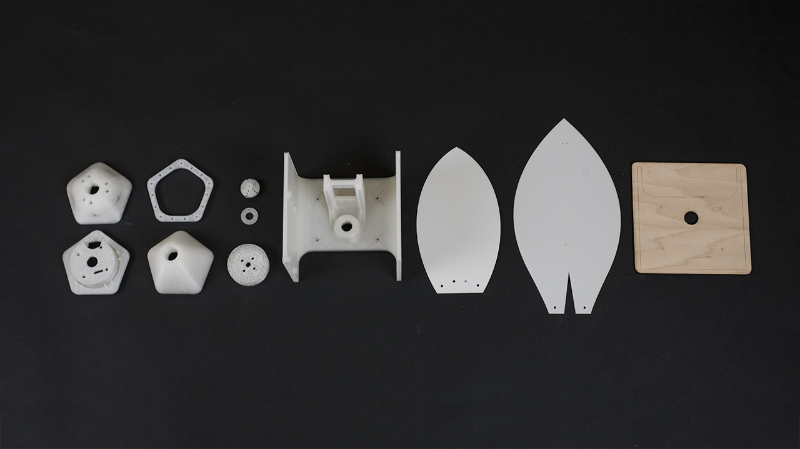
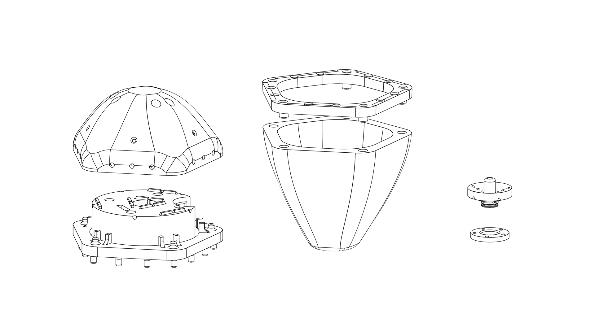
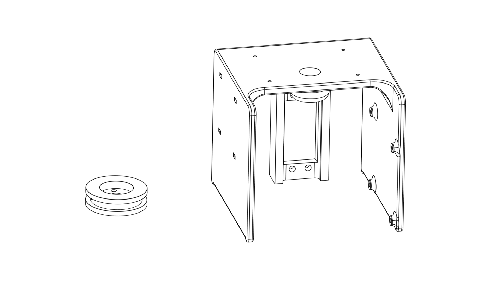
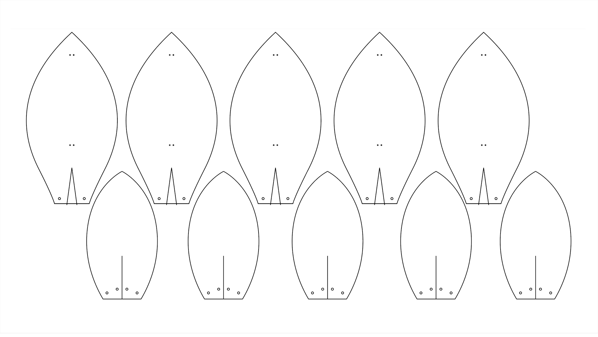
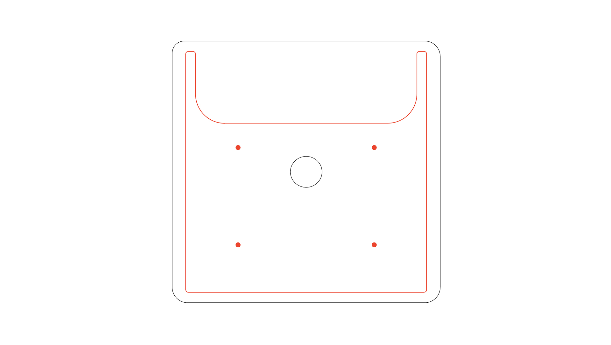

# Expression Flower Fabrication

This directory contains all the source files needed to fabricate one Expression Flower. These files are provided as a reference design and are intended to be modified. It is recommended to get theses files printed and laser cut before you start your assembly.

# About The Files
### 3D Printing
##### Flower head

- [3D_Printing_Flower_Head_Top_Cap.stl](/3D_Printing_Flower_Head_Top_Cap.stl)
- [3D_Printing_Flower_Head_LED_Cam_Insert.stl.stl](/3D_Printing_Flower_Head_LED_Cam_Insert.stl)
- [3D_Printing_Flower_Head_Retainer_Ring.stl](/3D_Printing_Flower_Head_Retainer_Ring.stl.stl)
- [3D_Printing_Flower_Head_Bottom_Cap.stl](/3D_Printing_Flower_Head_Bottom_Cap.stl)
- [3D_Printing_Flower_Head_WireHookAssembly.stl](/3D_Printing_Flower_Head_WireHookAssembly.stl)
- [3D_Printing_Flower_Head_WireHookRing.stl](/3D_Printing_Flower_Head_WireHookRing.stl)

Six 3D printed parts, provided in STL format, are used for the flower head assembly. They hold the camera module, LEDs and petals so the flower head will light up and move.

##### Base

- [3D_Printing_Flower_Base.stl](/3D_Printing_Flower_Base.stl)
- [3D_Printing_Flower_Base_Pulley.stl](/3D_Printing_Flower_Base_Pulley.stl)

Two parts are used for the base assembly: a stand holding the electronics and a pulley that actuates the wires of flower petals. Both parts are provided in STL format as well.

### Laser Cutting
##### Flower petals

- [Laser_Cutting_Petals.ai](/Laser_Cutting_Petals.ai)
- [Laser_Cutting_Petals.dxf](/Laser_Cutting_Petals.dxf)

Reference designs for laser cutting the petals are provided in Adobe Illustrator and DXF format, both use metric units.

##### Base cap

- [fab_laser_cutting_base.ai](/fab_laser_cutting_base.ai)
- [fab_laser_cutting_base.dxf](/fab_laser_cutting_base.dxf)

The base cap also users a laser cut part. The reference design caps the [5'' rectangular planter](https://www.amazon.com/gp/product/B06ZZ2PH57/ref=oh_aui_search_detailpage?ie=UTF8&psc=1) flower base. This part should be customized to fit the pot selected. The files are provided in Adobe Illustrator and DXF format and use metric units.

There are two layers in the file, cut (black) and engrave(red). The engraving layer is designed to align the piece with 3D printed base. It is recommended but not required.
